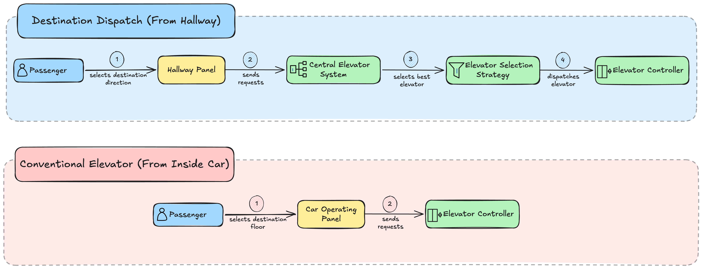

# Elevator System Low-Level Design (LLD)

A discrete-event, multi-car elevator control system implemented in Java 21 adhering to object-oriented design principles and standard elevator dispatching algorithms (SCAN/LOOK).

---

## 1. System Architecture Diagram



---

## 2. How to Build & Run

Always execute commands from the repository root:

### Compile
```bash
./mvnw clean compile
```

### Run Unit Tests
```bash
./mvnw test
```

### Run Simulation Demo
```bash
# Option A: Direct java execution
java -cp target/classes com.lld.elevator.ElevatorSystemDemo

# Option B: Via Maven exec plugin
./mvnw compile exec:java
```

---

## 3. Core Architecture & Design Decisions

### A. Flyweight Pattern for Floors ([`Floor`](src/main/java/com/lld/elevator/model/Floor.java))
* `Floor` utilizes the **Flyweight Pattern** via its static factory method `Floor.of(int id)`.
* Instead of creating duplicate `Floor` instances across cars, hallway panels, passenger requests, and stop queues, `Floor` maintains a thread-safe static cache (`ConcurrentHashMap<Integer, Floor>`).
* Calling `Floor.of(id)` returns the shared canonical instance (`computeIfAbsent`), conserving memory and ensuring consistent object references throughout the simulation.

### B. Panel Separation
* **[`HallwayPanel`](src/main/java/com/lld/elevator/panel/HallwayPanel.java)**: Represents the physical call box in the floor corridor with **UP** and **DOWN** buttons. It sends [`ExternalRequest`](src/main/java/com/lld/elevator/model/ExternalRequest.java) events to the central [`ElevatorSystem`](src/main/java/com/lld/elevator/service/ElevatorSystem.java).
* **[`CarOperatingPanel`](src/main/java/com/lld/elevator/panel/CarOperatingPanel.java)**: Represents the physical button panel inside a specific elevator cabin. It routes [`InternalRequest`](src/main/java/com/lld/elevator/model/InternalRequest.java) directly to its local [`ElevatorController`](src/main/java/com/lld/elevator/model/ElevatorController.java).
* *Rationale*: Separating hallway panels from cabin operating panels models real-world physical interfaces and decouples user interactions from internal scheduling logic.

### C. Strategy Pattern for Dispatching ([`ElevatorSelectionStrategy`](src/main/java/com/lld/elevator/strategy/ElevatorSelectionStrategy.java))
* Hall calls are evaluated by an elevator selection strategy.
* The default implementation, [`EstimatedTimeOfArrivalStrategy`](src/main/java/com/lld/elevator/strategy/EstimatedTimeOfArrivalStrategy.java), calculates the arrival time in seconds for each operational car and assigns the pickup to the fastest-arriving elevator based on true SCAN trajectory shapes.

### D. Observer Pattern for Telemetry ([`CarStatusListener`](src/main/java/com/lld/elevator/observer/CarStatusListener.java))
* [`ElevatorSystem`](src/main/java/com/lld/elevator/service/ElevatorSystem.java) registers as a listener on each [`ElevatorController`](src/main/java/com/lld/elevator/model/ElevatorController.java).
* Whenever a car moves, arrives at a floor, opens/closes doors, or changes direction, status updates are broadcast to registered listeners.

### E. SCAN / LOOK Elevator Scheduling with 4-Queue Partitioning
* Each [`ElevatorController`](src/main/java/com/lld/elevator/model/ElevatorController.java) manages movement using directional priority queues and deferred secondary queues:
  - `upStops`: Min-heap (smallest floor first) for the current upward sweep ($\ge \text{currentFloor}$).
  - `deferredUpStops`: UP requests received behind the car ($< \text{currentFloor}$) held for the subsequent upward sweep.
  - `downStops`: Max-heap (largest floor first) for the current downward sweep ($\le \text{currentFloor}$).
  - `deferredDownStops`: DOWN requests received behind the car ($> \text{currentFloor}$) held for the subsequent downward sweep.
* **Semantic Intent Tracking**:
  - `internalDestinations`: Set of cabin drop-off floors pressed inside the elevator.
  - `upPickupRequests` & `downPickupRequests`: Distinct sets for hallway boarding intents, preventing opposite-direction calls on the same floor from collapsing into a single premature stop.

---

***Note:*** Current open gaps & known limitations are being tracked in [docs/gaps.md](docs/gaps.md).