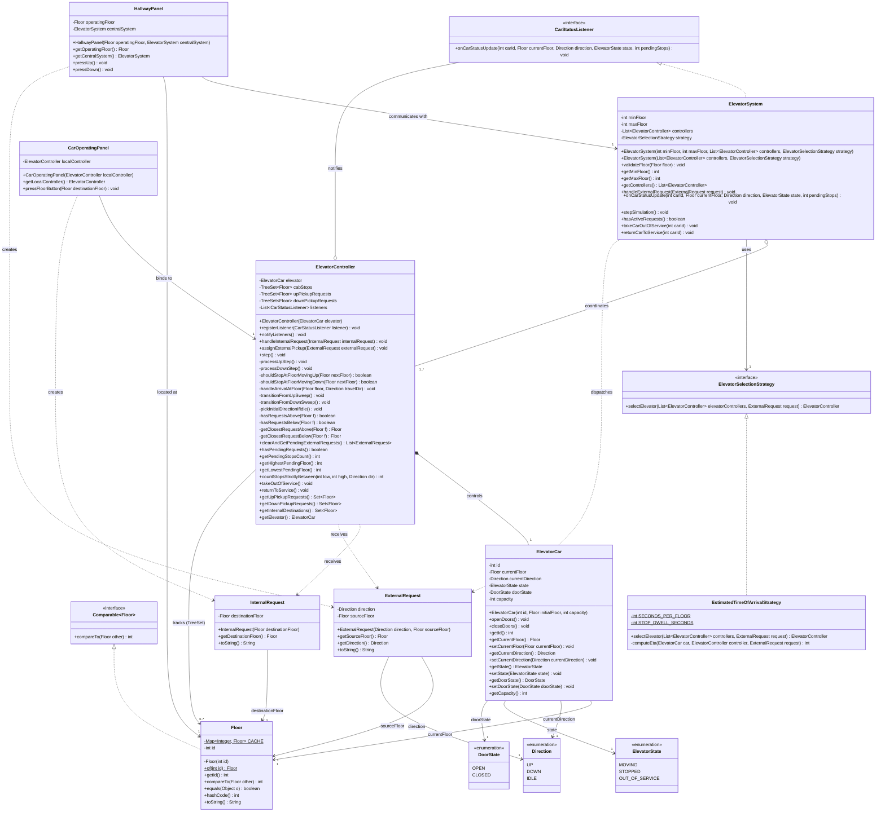
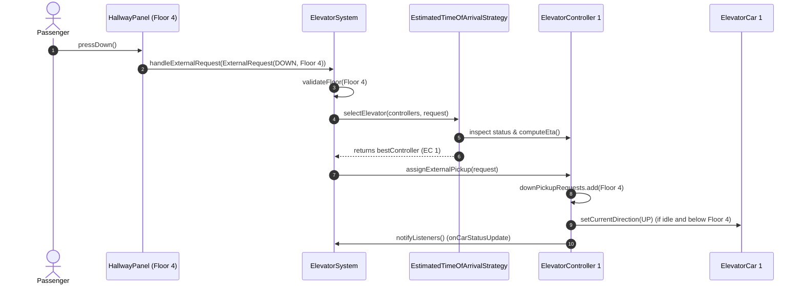
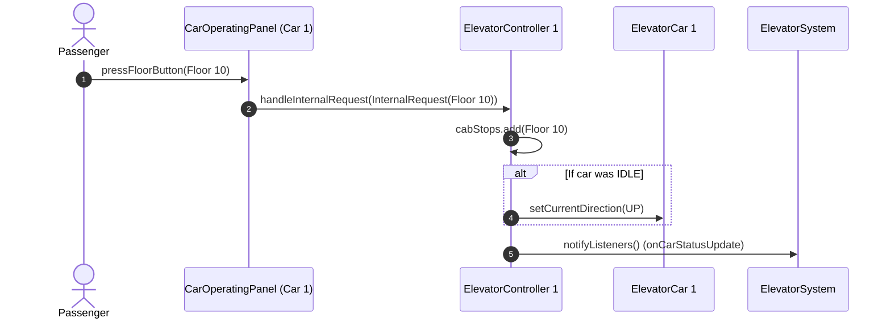
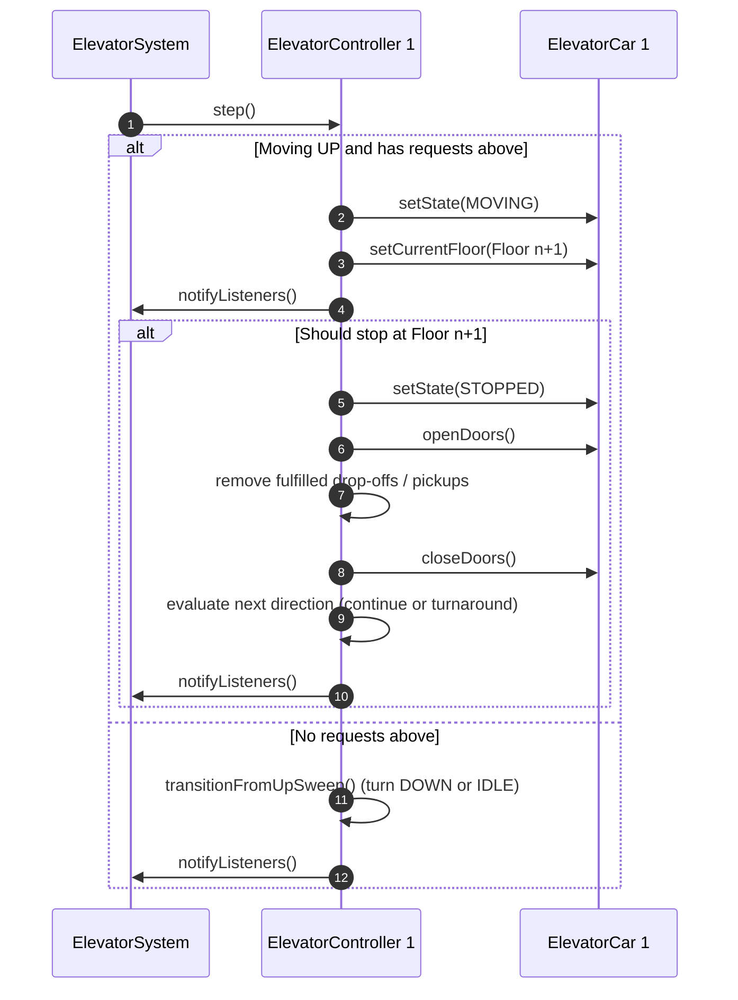

## 1. Complete UML Class Diagram

---

## 2. Interaction Sequence Diagrams

### A. External Hallway Call Workflow

### B. Internal Cab Request Workflow

### C. Simulation Step & Floor Arrival Workflow (LOOK Algorithm)

